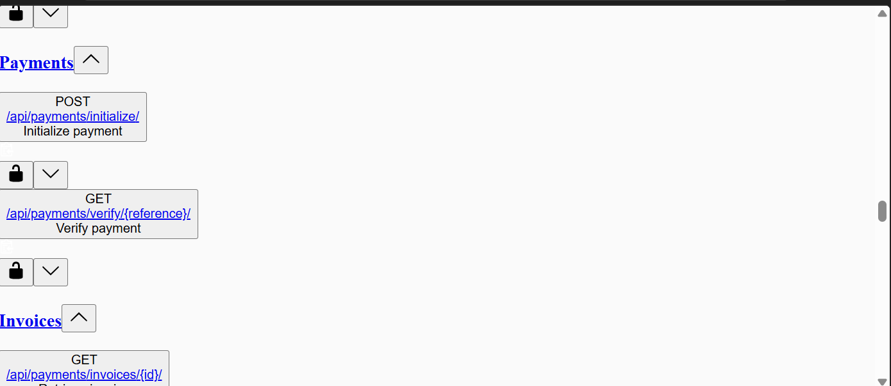

# Inventra — Multi-Tenant Inventory & Order Management Platform


A production-ready, multi-tenant backend platform for inventory management, order processing, payment orchestration, delivery logistics, and business analytics across multiple independent vendors.

Inventra demonstrates scalable backend architecture, strict tenant isolation, asynchronous processing, and production-focused engineering practices using Django, Django REST Framework, PostgreSQL, Redis, Celery, Docker, and Paystack.

---

# Features

* ✅ Multi-tenant architecture with strict data isolation
* ✅ JWT authentication and role-based access control
* ✅ Vendor, branch, and staff management
* ✅ SKU-based inventory management
* ✅ Branch-level stock tracking
* ✅ Inventory adjustment audit logs
* ✅ Complete order lifecycle management
* ✅ Automatic inventory deduction and restoration
* ✅ Paystack payment integration
* ✅ Idempotent webhook processing
* ✅ Invoice generation
* ✅ Delivery assignment and rider workflow
* ✅ Celery-powered asynchronous background tasks
* ✅ Redis caching and message broker
* ✅ Analytics dashboard with optimized aggregations
* ✅ Structured JSON logging and request tracing
* ✅ Dockerized production deployment

---

# Why Inventra?

Inventra was designed to simulate the backend architecture of a modern multi-vendor commerce platform.

Rather than focusing on basic CRUD functionality, the project emphasizes:

* scalable multi-tenant design
* secure tenant isolation
* asynchronous processing
* payment workflows
* inventory consistency
* analytics optimization
* production deployment
* observability and traceability

The architecture is intended to resemble real-world SaaS backend systems.

---

# Tech Stack

| Category         | Technology                |
| ---------------- | ------------------------- |
| Language         | Python 3.13               |
| Framework        | Django 6                  |
| API              | Django REST Framework     |
| Database         | PostgreSQL 16             |
| Cache            | Redis 7                   |
| Background Tasks | Celery                    |
| Authentication   | JWT                       |
| Payments         | Paystack                  |
| Documentation    | Swagger / ReDoc / OpenAPI |
| Containerization | Docker Compose            |
| WSGI Server      | Gunicorn                  |
| Reverse Proxy    | Nginx                     |

---

# System Architecture

```
                        ┌──────────────┐
                        │   Nginx :80  │
                        └──────┬───────┘
                               │
                        ┌──────▼───────┐
                        │    Web :8000 │
                        │ Gunicorn + DRF │
                        └──────┬───────┘
                               │
          ┌────────────────────┼────────────────────┐
          │                    │                    │
   ┌──────▼──────┐    ┌───────▼───────┐    ┌───────▼──────┐
   │ PostgreSQL  │    │    Redis      │    │    Celery    │
   │   Database  │    │ Cache/Queue   │    │    Worker    │
   └─────────────┘    └───────────────┘    └──────────────┘
```

---

# Core Modules

## Vendor Management

* Vendor onboarding
* Branch management
* Staff invitations
* Role-based permissions
* Multi-tenant isolation

Supported roles:

* Owner
* Manager
* Inventory Staff
* Dispatcher
* Rider

---

## Inventory Management

* Product catalog
* Categories
* Auto-generated SKU codes
* Branch inventory tracking
* Low-stock alerts
* Stock adjustments
* Inventory audit history

---

## Order Management

Order workflow:

```
Pending
    │
    ▼
Confirmed
    │
 ┌──┴──┐
 ▼     ▼
Completed
Cancelled
```

Business rules automatically:

* deduct inventory
* restore inventory on cancellation
* create audit records
* trigger notifications
* trigger delivery creation

---

## Payment Processing

Integrated with Paystack.

Features include:

* Payment initialization
* Transaction verification
* Secure webhook processing
* Idempotent webhook handling
* Invoice generation
* Transaction history

---

## Delivery Management

Delivery lifecycle:

```
Pending
    │
Assigned
    │
Picked Up
    │
In Transit
    │
Delivered
```

Supports:

* rider assignment
* delivery status updates
* event logging
* notification triggers

---

## Analytics Dashboard

Optimized aggregation queries provide:

* revenue metrics
* profit calculations
* customer intelligence
* inventory health
* delivery performance
* order statistics

Redis caching is used to reduce repeated database load.

---

# Engineering Highlights

## Multi-Tenant Isolation

Every tenant-aware endpoint inherits from a shared isolation mixin that automatically filters querysets through vendor membership relationships.

This guarantees:

* users can only access their own vendor data
* cross-tenant resource access returns **404 Not Found**
* resource enumeration attacks are prevented

---

## Optimized Database Queries

Dashboard analytics were optimized using Django conditional aggregations with `Sum`, `Count`, `Q`, and `F` expressions.

Multiple sequential queries were consolidated into single aggregate queries, significantly reducing database round trips and improving dashboard performance.

---

## Asynchronous Task Processing

Celery workers process long-running tasks outside the request cycle.

Current background jobs include:

* notification delivery
* invoice PDF generation
* vendor invitation emails

Transient failures automatically retry while programming errors fail immediately.

---

## Request Tracing & Structured Logging

Every request receives a unique `X-Request-ID`.

The identifier propagates through:

* middleware
* application logs
* Celery tasks
* response headers

Logs are emitted as structured JSON for compatibility with centralized logging platforms.

---

# API Features

* JWT Authentication
* RESTful API design
* OpenAPI schema generation
* Swagger UI
* ReDoc documentation
* Pagination
* Filtering
* Search
* Validation
* Permission-based authorization
* Tenant-aware querysets

---

# Project Structure

```
inventra_backend/

├── apps/
│   ├── accounts/
│   ├── analytics/
│   ├── audit_logs/
│   ├── common/
│   ├── deliveries/
│   ├── inventory/
│   ├── notifications/
│   ├── orders/
│   ├── payments/
│   └── vendors/
│
├── config/
├── Dockerfile
├── docker-compose.yml
└── .env.template
```

---

# Local Setup

## Docker

```bash
git clone <repository-url>

cd inventra_backend

cp .env.template .env

docker compose up --build
```

API:

```
http://localhost
```

Swagger:

```
/api/swagger/
```

ReDoc:

```
/api/redoc/
```

Schema:

```
/api/schema/
```

---

## Local Development

```bash
python -m venv venv

source venv/bin/activate

pip install -r requirements.txt

cp .env.template .env

python manage.py migrate

python manage.py runserver
```

---

# Environment Variables

Key configuration values include:

* SECRET_KEY
* DEBUG
* DB_NAME
* DB_USER
* DB_PASSWORD
* DB_HOST
* DB_PORT
* REDIS_CACHE_URL
* CELERY_BROKER_URL
* PAYSTACK_PUBLIC_KEY
* PAYSTACK_SECRET_KEY
* LOG_LEVEL
* SENTRY_DSN

See `.env.template` for the complete configuration reference.

---

# Future Improvements

* Kubernetes deployment
* Horizontal worker autoscaling
* Prometheus metrics
* Grafana dashboards
* OpenTelemetry tracing
* Event streaming
* API rate limiting
* Object storage for invoices
* CI/CD pipeline
* Comprehensive test coverage

---

# API Documentation



The screenshot above shows the auto-generated Swagger/OpenAPI specification for all API endpoints. You can explore and test the live API interactively at:
- **Swagger UI:** `/api/swagger/`
- **ReDoc:** `/api/redoc/`
- **Schema (JSON):** `/api/schema/`

---

# License

Proprietary — All rights reserved.
